## Lockless Single Producer Single Consumer Queue

We will be discussing about the mechanism by which the XDP socket library and the Linux Kernel work together to move packets between the user-kernel boundary with no copies, and how it maintains a lockless access to this shared queue. <br>

The 2 queues of interest here are the FillQ and the RxQ.
The FillQ has the userspace as the producer and the Kernel as the consumer.
The RxQ has the Kernel as the producer and the userspace as the consumer.

We will go through the queue usage and mechanics step by step with the help of code blocks and diagrams. <br>

**We consider FillQ first**
# Step 1
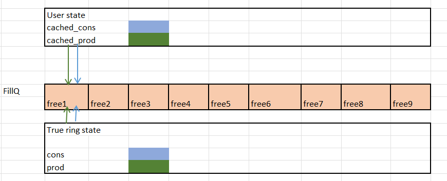
```
In the Initial state, we have an empty FillQ denoted by free1 to free9. There is a consumer and producer pointer for this queue, reference by the term 'True ring state'.

Similarly there is the userspace local consumer and producer pointers known as 'cached_cons' (blue) and 'cached_prod' (green).
```

# Step 2
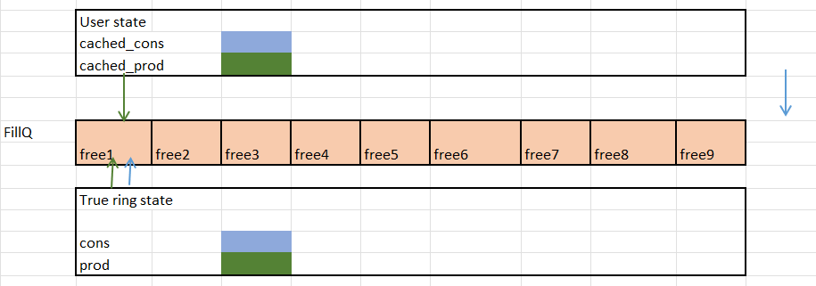
The function xsk\_ring\_prod\_\_reserve(fq) is used to move the cached\_cons from 0 to cached\_cons + queue\_size. The relevance of this action will be understood at a later step.
```C

static inline __u32 xsk_ring_prod__reserve(struct xsk_ring_prod *prod, __u32 nb, __u32 *idx)
{
        if (xsk_prod_nb_free(prod, nb) < nb)    # Check if atleast nb descriptors are free
                return 0;

        *idx = prod->cached_prod;
        prod->cached_prod += nb;	# Move cached_producer ahead by nb (queue size in this case).

        return nb;
}
```
Below is the definition for xsk\_prod\_nb\_free()

```C
static inline __u32 xsk_prod_nb_free(struct xsk_ring_prod *r, __u32 nb)
{
        static __u64 counter = 0;
        __u32 free_entries = r->cached_cons - r->cached_prod;

        if (free_entries >= nb)
                return free_entries;

        /* Refresh the local tail pointer.
         * cached_cons is r->size bigger than the real consumer pointer so
         * that this addition can be avoided in the more frequently
         * executed code that computs free_entries in the beginning of
         * this function. Without this optimization it whould have been
         * free_entries = r->cached_prod - r->cached_cons + r->size.
         */
        r->cached_cons = libbpf_smp_load_acquire(r->consumer);			# Updates cached_cons with true cons, which is 0 in this case
        r->cached_cons += r->size;						# Adds queue size to cached_cons

        if(counter == 0) {
                printf("In producer 2 r->cached_prod: %d; r->cached_cons: %d\n", r->cached_prod, r->cached_cons);
                counter++;
        }

        return r->cached_cons - r->cached_prod;					# Returns number of free descriptors which in this case is the size of the queue.
}


```
# Step 3

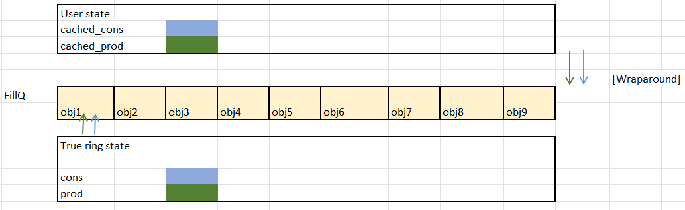

xsk\_ring\_prod\_\_fill\_addr() is used to fill the FillQ descriptors with the correct UMEM frame addresses.
```C

static inline __u64 *xsk_ring_prod__fill_addr(struct xsk_ring_prod *fill,
                                              __u32 idx)
{
        __u64 *addrs = (__u64 *)fill->ring;

        return &addrs[idx & fill->mask];		# Returns the descriptor address at each index
							# The returned address is dereferenced and set to the UMEM frame address.
}


```
The above image shows the state after the last part of xsk\_ring\_prod\_\_reserve and the whole of xsk\_ring\_prod\_\_fill\_addr have executed. At this juncture, the cached\_prod and cached\_cons have moved forward by the queue size and all the descriptors have entries in them.

# Step 4

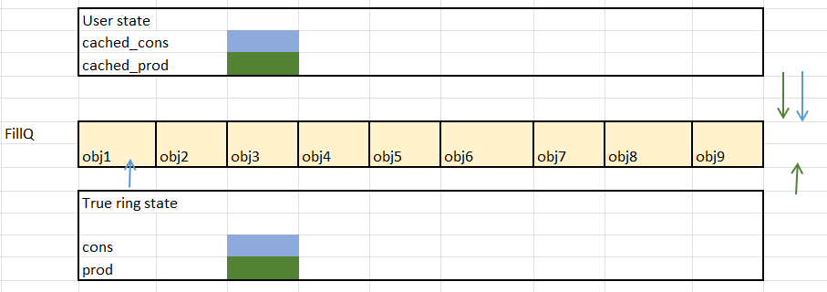

xsk\_ring\_prod\_\_submit() is used to do 2 important things: <br>
1. Update the true prod pointer
2. Signal to the kernel that the FillQ is ready for consumption
```C
static inline void xsk_ring_prod__submit(struct xsk_ring_prod *prod, __u32 nb)
{
        /* Make sure everything has been written to the ring before indicating
         * this to the kernel by writing the producer pointer.
         */
        libbpf_smp_store_release(prod->producer, *prod->producer + nb);
}

```
The libbpf\_smp\_store\_release macro is defined below: <br>
```C
# define libbpf_smp_store_release(p, v)                                 \
        do {                                                            \
                asm volatile("" : : : "memory");                        \ # The "memory" in the clobber field acts as a write memory barrier.
                __XSK_WRITE_ONCE(*p, v);                                \
        } while (0)

```

Now, it is the kernel's turn to consume the FillQ.

# Step 5

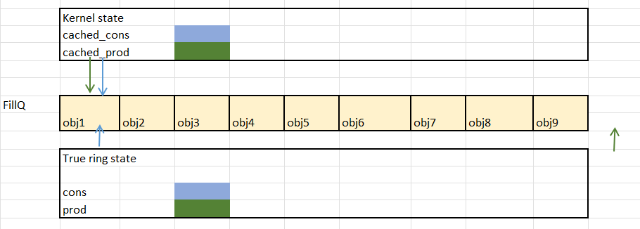

The real 'cons' and 'prod' values of the FillQ have been updated based on the previous steps initiated by the user. <br>
The cached\_cons and cached\_prod variables of the kernel local state are both at 0 in the INITIAL STATE. <br>
The driver code invokes the function xp\_alloc() through the below call chain: <br>

For Intel ice driver: drivers/net/ethernet/intel/ice/ice\_base.c
```C
int ice_vsi_cfg_rxq()
	--->  ice_alloc_rx_bufs_zc()
		---> xsk_buff_alloc()
			---> xp_alloc()
				---> __xp_alloc()
					---> xskq_cons_peek_addr_unchecked()

```
# Step 6

xskq\_cons\_peek\_addr\_unchecked is the important function which drives the access of the lockless FillQ forward. <br>

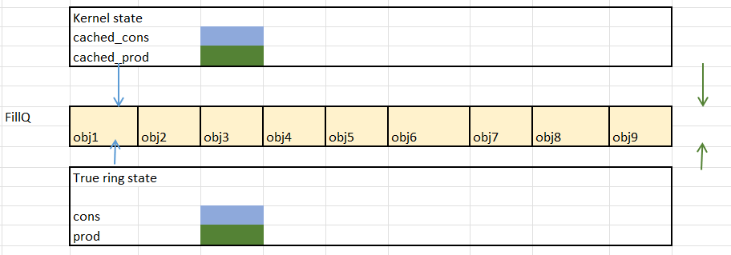
```C
static inline bool xskq_cons_peek_addr_unchecked(struct xsk_queue *q, u64 *addr)
{
        if (q->cached_prod == q->cached_cons)
                xskq_cons_get_entries(q);			# Updates true_cons with cached_cons value, which in this case is 0.
								# Updates cached_prod with true_prod value, which in this case is queue_size. 
        pr_debug("KERNEL: %s fillq->cached_prod: %d fillq->cached_cons: %d\n", __func__,
               q->cached_prod, q->cached_cons);
        return xskq_cons_read_addr_unchecked(q, addr);		# Consumes FillQ descriptor
}

```
# Step 7 and 8 
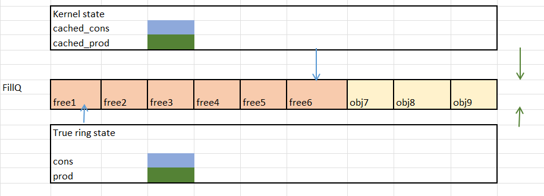
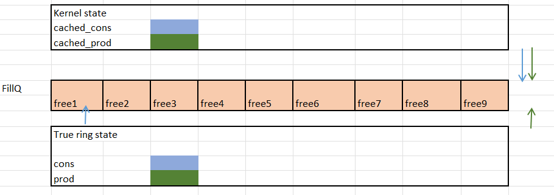

As mentioned above, in xskq\_cons\_peek\_addr\_unchecked(), the FillQ descriptor is accessed and the UMEM frame address is returned to the kernel. <br>
The kernel then obtains the DMA address of this returned virtual address, and fills in the HW descriptor of the Network card. <br>

# Step 9
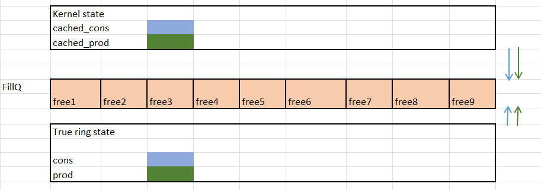

As mentioned earlier in 'Step 6', the xskq\_cons\_peek\_addr\_unchecked() calls xskq\_cons\_get\_entries(), which will update the true cons pointer with the cached cons value whenever cached\_prod == cached\_cons, and so the true cons value moves forward by queue\_size, and due to wrap around, the state of the FillQ is the same as Step 1.

**We will now consider the RxQ**

# Step 1
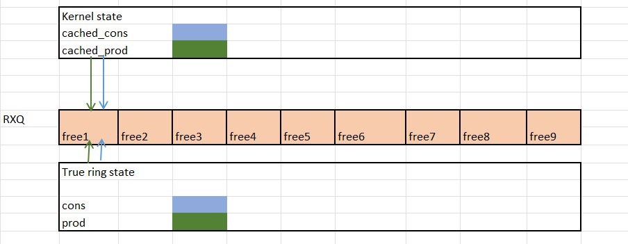

The initial state of the RxQ has the true cons and prod pointers at 0. The kernel's local pointers, cached\_cons and cached\_prod are also at 0 initially. <br>

# Step 2
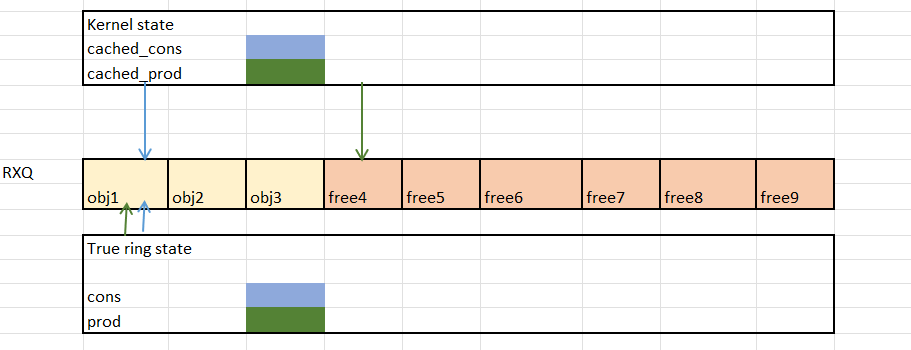
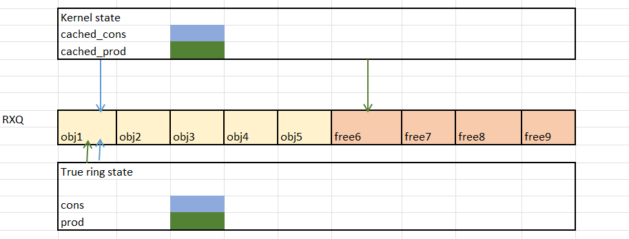

For an AF\_XDP socket, when a packet arrives at the network interface, an XDP program is executed and the final decision is XDP\_REDIRECT. <br>

For this REDIRECT condition, the call chain is as follows, for the Intel ice driver:
```C
        act = bpf_prog_run_xdp(xdp_prog, xdp);

        if (likely(act == XDP_REDIRECT)) {
                err = xdp_do_redirect(rx_ring->netdev, xdp, xdp_prog);
                if (err)
                        goto out_failure;
                return ICE_XDP_REDIR;
        }

```
The bpf\_prog\_run\_xdp() will execute the XDP program on the XDP frame.

When the decision is XDP\_REDIRECT, the function invokes xdp\_do\_redirect().

The call chain continues as follows:
```C
	xdp_do_redirect
		--->  __xdp_do_redirect_xsk()
			---> __xsk_map_redirect()
				---> xsk_rcv()
					---> __xsk_rcv_zc()
						
```

The \_\_xsk\_rcv\_zc() is of importance to lockless queue access. The code is shown below:
```C
static int __xsk_rcv_zc(struct xdp_sock *xs, struct xdp_buff *xdp, u32 len)
{       
        struct xdp_buff_xsk *xskb = container_of(xdp, struct xdp_buff_xsk, xdp);
        u64 addr;
        int err;

        addr = xp_get_handle(xskb);
        err = xskq_prod_reserve_desc(xs->rx, addr, len);
        if (err) {
                xs->rx_queue_full++;
                return err;
        }

        xp_release(xskb);
        return 0;
}
```

The xskq\_prod\_reserve\_desc() fills up the RX queue and updates the Kernel's cached\_prod.
```C
static inline int xskq_prod_reserve_desc(struct xsk_queue *q,
                                         u64 addr, u32 len)
{
        struct xdp_rxtx_ring *ring = (struct xdp_rxtx_ring *)q->ring;
        u32 idx;
        
        if (xskq_prod_is_full(q))
                return -ENOSPC;
                
        /* A, matches D */
        idx = q->cached_prod++ & q->ring_mask;

        ring->desc[idx].addr = addr;
        ring->desc[idx].len = len;
        
        return 0;
}
```

# Step 3


When the NAPI poll loop exits, it invokes xdp\_do\_flush(). The call chain for this function is as follows:
```C
	xdp_do_flush()
		---> __xsk_map_flush()
			---> xsk_flush()
				---> xskq_prod_submit()
					---> __xskq_prod_submit()
						---> smp_store_release(&q->ring->producer, idx);
```
The last function in the call chain updates the true prod value with the cached\_prod value.

# Step 4
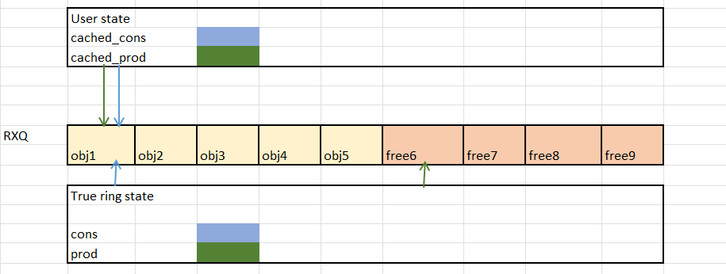

Once the FillQ has been filled by the userspace, it waits for packets to arrive at it's RxQ. It does this poll using the function xsk\_ring\_cons\_\_peek(). <br>

# Step 5


The xsk\_ring\_cons\_\_peek() calls xsk\_cons\_nb\_avail(), whose definition is shown below:
```C
static inline __u32 xsk_cons_nb_avail(struct xsk_ring_cons *r, __u32 nb)
{
        __u32 entries = r->cached_prod - r->cached_cons;
        static __u64 counter = 0;

        if (entries == 0) {
                r->cached_prod = libbpf_smp_load_acquire(r->producer);
                entries = r->cached_prod - r->cached_cons;
        }
        
        return (entries > nb) ? nb : entries;
}
```
Since cached\_cons and cached\_prod are 0, the entries variable will also be 0, and this function updates the cached\_prod with the true prod.

It then returns the number of filled entries currently in the RxQ.

# Step 6
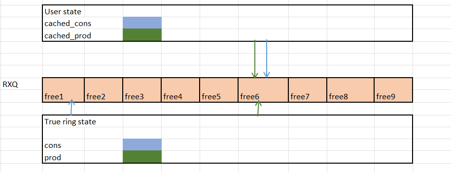

For the number of available entries(rcvd), read the address from the RxQ descriptor and access the packet metadata and packet data. <br>
```C
for (i = 0; i < rcvd; i++) {
                u64 addr = xsk_ring_cons__rx_desc(&xsk->rx, idx_rx)->addr;
                u32 len = xsk_ring_cons__rx_desc(&xsk->rx, idx_rx++)->len;
                u64 orig = xsk_umem__extract_addr(addr);

                addr = xsk_umem__add_offset_to_addr(addr);
                char *pkt = xsk_umem__get_data(xsk->xsk_umem_i->buffer, addr);

                *xsk_ring_prod__fill_addr(&xsk->xsk_umem_i->fq, idx_fq++) = orig;
        }
```
The final call to xsk\_ring\_prod\_\_fill\_addr() is to refill the FillQ after consuming the packet. 

# Step 7
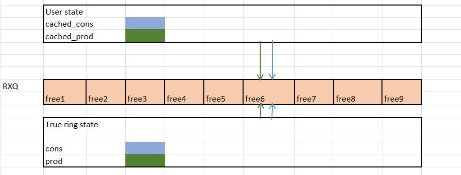

Once all the descriptors have been consumed, a call to xsk\_ring\_cons\_\_release() will update the true cons value with the cached\_cons value. 

## Main takeaway

The above sequence of steps shows how a producer and consumer, can access a shared data structure (FillQ, RxQ) without locks and still maintain concurrency. <br>
**Using individual local pointers for updates, and only reading/writing the shared pointers at specific junctures, with memory barrier support, the lockless queue implementation is successfully implemented.**
